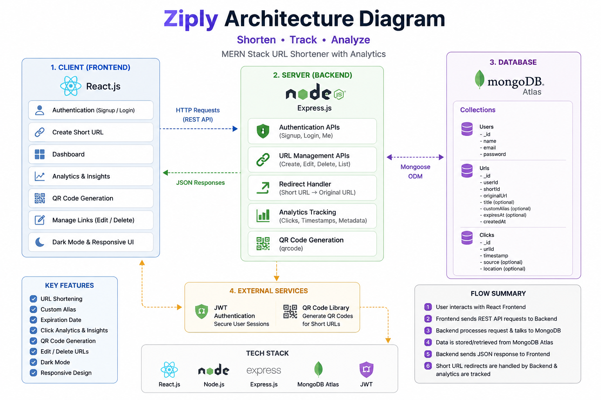

# 🚀 Setup Instructions

## 1️⃣ Clone the Repository

```bash
git clone YOUR_GITHUB_REPOSITORY_LINK
```

---

## 2️⃣ Navigate to Project Folder

```bash
cd Ziply
```

---

# 📦 Backend Setup

## 3️⃣ Navigate to Backend Folder

```bash
cd server
```

---

## 4️⃣ Install Backend Dependencies

```bash
npm install
```

---

## 5️⃣ Create Environment Variables

Create a `.env` file inside the `server` folder and add:

```env
PORT=5000
MONGO_URI=YOUR_MONGODB_ATLAS_URI
JWT_SECRET=YOUR_SECRET_KEY
```

---

## 6️⃣ Start Backend Server

```bash
npm start
```

Backend will run on:

```bash
http://localhost:5000
```

---

# 💻 Frontend Setup

## 7️⃣ Open New Terminal

Navigate to frontend folder:

```bash
cd client
```

---

## 8️⃣ Install Frontend Dependencies

```bash
npm install
```

---

## 9️⃣ Start Frontend

```bash
npm run dev
```

Frontend will run on:

```bash
http://localhost:5173
```

---

# ✅ Application Ready

Now open the frontend URL in browser and use the application.

Users can:

* Signup/Login
* Create Short URLs
* Generate QR Codes
* Track Analytics
* View Click Trends
* Edit/Delete URLs
* Use Dark Mode


# 🧪 Assumptions Made

* Users must create an account and login before accessing the dashboard.
* Each authenticated user can only manage their own shortened URLs.
* MongoDB Atlas is used as the cloud database for storing users, URLs, and analytics data.
* JWT tokens are used for secure authentication and protected routes.
* URL redirection is handled entirely from the backend server.
* QR Codes will work properly after deployment using live domain URLs.
* Analytics such as click count and visit timestamps are stored in the database.
* The application assumes users provide valid URLs starting with `http://` or `https://`.
* Expired links should no longer redirect users after the expiry date is reached.
* Internet connection is required for API communication and database access.
* The project is built primarily for modern browsers and responsive devices.
* Environment variables are required for backend configuration and security.
* REST APIs are used for all frontend-backend communication.
* Deployment platforms such as Vercel and Render are assumed for hosting frontend and backend services.


# 🧠 AI Planning Document

## 📌 Project Goal

The main goal of Ziply was to build a modern full-stack URL Shortener application with analytics tracking using the MERN stack.
The application should allow authenticated users to create, manage, and analyze shortened URLs through a responsive dashboard.

---

# 🛠️ Development Planning Workflow

## Phase 1 — Authentication System

Planned Features:

* User Signup
* User Login
* JWT Authentication
* Protected Routes

Implementation:

* Created authentication APIs using Express.js
* Used JWT tokens for secure login sessions
* Stored tokens in localStorage
* Protected dashboard and analytics routes

---

## Phase 2 — URL Shortening Logic

Planned Features:

* Generate short URLs
* Unique short code generation
* Redirect handling
* URL validation

Implementation:

* Used NanoID for generating unique short codes
* Stored URLs in MongoDB Atlas
* Implemented backend redirect route
* Added validation for proper URLs

---

## Phase 3 — User Dashboard

Planned Features:

* Display all created URLs
* Copy short links
* Delete URLs
* Responsive UI

Implementation:

* Built dashboard using React and Tailwind CSS
* Added table layout for URL management
* Added responsive mobile support
* Added toast notifications and loading states

---

## Phase 4 — Analytics System

Planned Features:

* Click count tracking
* Visit timestamp tracking
* Analytics dashboard
* Click trend visualization

Implementation:

* Stored analytics data in MongoDB
* Tracked click history during redirects
* Created analytics dashboard page
* Added graphs using Recharts

---

## Phase 5 — Bonus Features

Implemented Bonus Features:

* QR Code generation
* Custom alias URLs
* Expiry date support
* Edit destination URL
* Dark Mode UI
* Analytics graph visualization

---

## Phase 6 — UI/UX Improvements

Goals:

* Modern SaaS dashboard design
* Responsive layouts
* Professional UI styling
* Better user experience

Implementation:

* Redesigned pages with polished layouts
* Added smooth transitions and hover effects
* Improved spacing and typography
* Added loading animations and custom toast notifications

---

# 🤖 AI Tools Used

The following AI tools were used during development:

* ChatGPT
* Claude AI

AI assistance was used for:

* UI/UX enhancement
* Feature planning
* Debugging
* Responsive design improvements
* Styling optimizations
* Architecture guidance

---

# ✅ Final Outcome

Ziply successfully achieved:

* Full-stack URL shortening system
* Secure authentication
* Real-time analytics tracking
* Responsive SaaS dashboard
* Multiple bonus features
* Modern production-style UI


# 🏗️ Architecture Diagram

```text id="1w1bvw"
┌─────────────────────┐
│     React Client    │
│   (Frontend UI)     │
└─────────┬───────────┘
          │ REST API Calls
          ▼
┌─────────────────────┐
│   Express Backend   │
│  Node.js REST APIs  │
└─────────┬───────────┘
          │ Database Queries
          ▼
┌─────────────────────┐
│   MongoDB Atlas     │
│   Cloud Database    │
└─────────────────────┘
```

---

# 🔄 Application Flow

1. User logs into Ziply
2. Frontend sends API requests to backend
3. Backend validates requests using JWT
4. URL data is stored in MongoDB Atlas
5. Redirects and analytics are handled server-side
6. Dashboard displays analytics and click tracking




# 🎥 Project Demonstration Video

Loom / YouTube Demo Link:

https://your-video-link-here.com

The video includes:
- Project overview
- Authentication flow
- URL shortening
- Custom aliases
- QR code generation
- Analytics dashboard
- Edit/Delete functionality
- Dark mode
- Responsive UI walkthrough
- Architecture explanation
- Hackathon bonus features


---
This project is a part of a hackathon run by https://katomaran.com